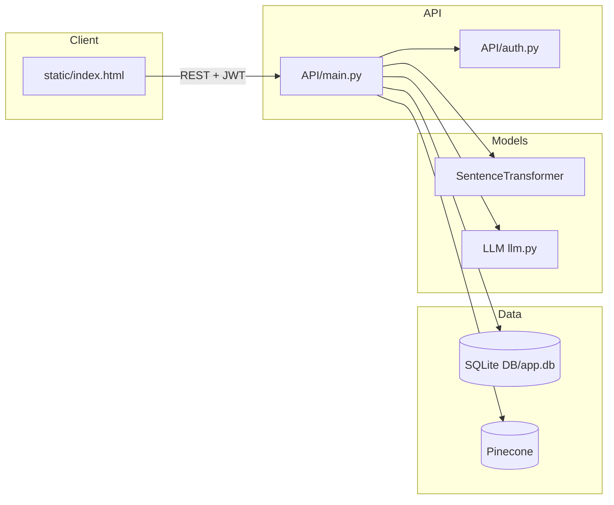
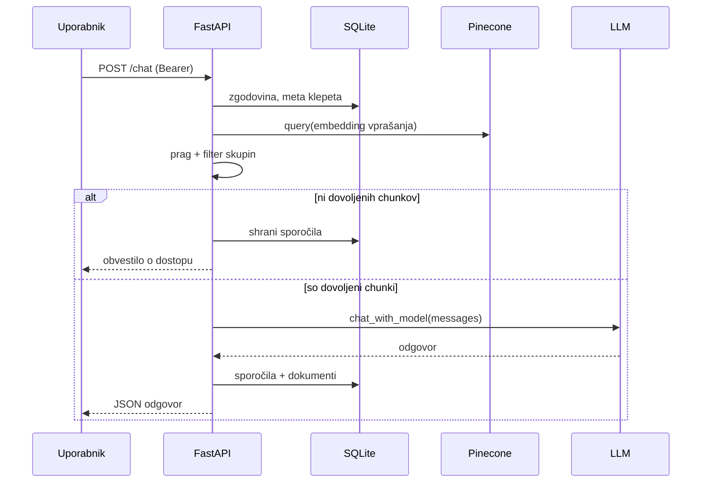
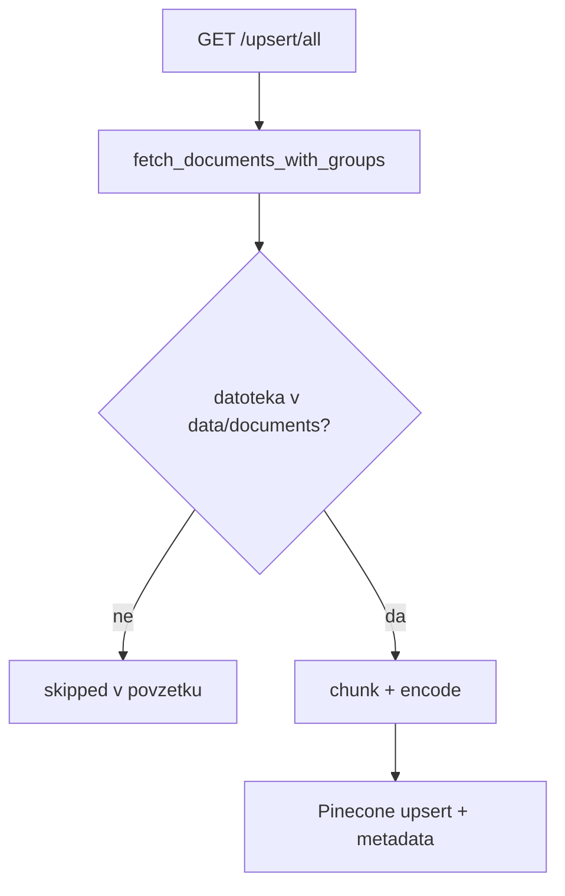

# Arnes Sinji Delfini — dokumentacija projekta

*Verzija: ustrezna stanju repozitorija (hackathon / demo RAG klepet). Jezik: slovenščina.*

---

## 1. Namen in povzetek

Projekt je spletni demostrant »varnega« klepeta nad internimi dokumenti: uporabnik se prijavi, klepetuje v vmesniku, odgovori pa temeljijo na semantičnem iskanju po vektorjih (Pinecone), pri čemer se upoštevajo skupine dostopa (SQLite). Jezikovni model lahko teče lokalno (Transformers + opcijski LoRA) ali prek oddaljenega API-ja (OpenAI / Gemini prek enotnega adapterja).

**Jedro:**

- FastAPI aplikacija v mapi `API/` (vstopna točka, REST + statični UI)
- SQLite baza za uporabnike, skupine, dokumente, klepete in revokacijo JWT
- Pinecone indeks za goste vektorje besedilnih kosov dokumentov
- Sentence-Transformers za enake embeddinge pri upsertu in retrievalu
- Modul `LLM/` za nalaganje in generiranje odgovorov

---

## 2. Tehnološki sklad

- Python 3, FastAPI, Uvicorn, Pydantic
- SQLite (sqlite3), PyJWT, passlib (PBKDF2)
- Pinecone (vektorski indeks), sentence-transformers  
  - Model: `paraphrase-multilingual-MiniLM-L12-v2` (384 dimenzij, cosine)
- LLM: transformers, torch, peft (LoRA), bitsandbytes (4-bit, opcijsko) ali OpenAI / Gemini SDK prek notranjega API načina
- Frontend: enotna datoteka `static/index.html` (vanilla JS, kliče REST API)
- Konfiguracija: python-dotenv (`.env` v korenu projekta, ni v gitu)

Podrobnosti odvisnosti: `requirements.txt`  
Navodila za zagon in `.env`: `README.md`

---

## 3. Drevesna struktura projekta (datoteke v repozitoriju)

```text
arnes-hackathon/
├── .gitignore
├── dokumentacija.md           ← ta datoteka
├── README.md
├── requirements.txt
├── test_data.zip                (ZIP z vzorčnimi dokumenti)
│
├── API/                         (FastAPI — HTTP vmesnik)
│   ├── main.py                  (aplikacija, endpointi, lifespan, mount /ui)
│   └── auth.py                  (JWT, bcrypt/pbkdf2, Depends get_current_user)
│
├── DB/                          (perzistentna plast)
│   ├── db.py                    (razred Db — vse SQL operacije)
│   ├── sqlite_init.sql          (shema tabele)
│   ├── seed.sql                 (demo uporabniki, skupine, dokumenti)
│   └── app.db                   (ustvari se ob poganjanju; običajno .gitignore)
│
├── LLM/                         (jezikovni model)
│   └── llm.py                   (lokalni GaMS3 + LoRA ali API način)
│   (priporočena mapa LLM/finetuning/ — glej README)
│   (predpomnilnik LLM/models/ — ob prvem zagonu)
│
├── RAG/                         (retrieval, indeksiranje, pravice)
│   ├── retrieval.py             (Pinecone query, TOP_K, normalizacija zadetkov)
│   ├── upsert.py                (branje datotek, chunking, upsert v Pinecone)
│   ├── acces_controll.py        (prag zadetkov + filter po skupinah)
│   ├── openai_reply.py          (alternativni async RAG odgovor prek OpenAI;
│   │                             glavni tok uporablja LLM/llm.py)
│   ├── test-retrieval.py
│   └── test-upsert.py
│
├── data/                        (vsebina dokumentov in JSON dovoljenj)
│   ├── permissions.json         (dokument → allowed_groups za dinamični seed)
│   └── documents/
│       ├── doc1.txt … doc6.txt
│       └── stroski_2023.csv
│
├── finetuning/                  (orodja za pripravo podatkov in fine-tuning)
│   ├── README.md                (navodila za fine-tuning pipeline)
│   ├── configs/                 (konfiguracije za pripravo podatkov, učenje in primerjavo)
│   ├── data/                    (korpus, chunki, SFT nizi in eval primeri)
│   ├── runs/                    (rezultati zagonov: adapterji, checkpointi, primerjave)
│   ├── scripts/                 (Python skripte za pripravo, učenje, evalvacijo, izvoz)
│   └── slurm/                   (batch skripte za zagon na gruči Arnes SLING)
│
└── static/                      (spletni UI, serviran pod /ui/)
    ├── index.html               (login, seznam klepetov, composer, klici API)
    └── images/
        ├── logo1.png, logo2.png, Sinji Delfini-Photoroom.png
        └── favicon_io/          (ikone, manifest)
```

> **Opomba:** ime datoteke `RAG/acces_controll.py` vsebuje tipkarsko napako (*acces* namesto *access*); v kodi in uvozih ostaja tako.

---

## 4. Visoko nivojska arhitektura (ASCII)

```text
                        ┌─────────────────┐
                        │  Brskalnik      │
                        │  /ui/index.html │
                        └────────┬────────┘
                                 │ HTTP (JSON, Bearer JWT)
                                 ▼
                        ┌─────────────────┐
                        │  FastAPI        │
                        │  API/main.py    │
                        └────────┬────────┘
              ┌──────────────────┼──────────────────┐
              ▼                  ▼                  ▼
       ┌────────────┐    ┌─────────────┐    ┌──────────────┐
       │ SQLite Db  │    │ Pinecone    │    │ LLM (lokalno │
       │ DB/db.py   │    │ indeks RAG  │    │ ali API)     │
       └────────────┘    └─────────────┘    └──────────────┘
              │                  ▲
              │                  │ upsert (chunk + metadata)
              └──────────────────┘
                   (dokumenti + skupine iz DB + besedilo iz data/documents/)
```

---

## 5. Tok obdelave klepeta `POST /chat` (ASCII)

```text
  Uporabnik pošlje { chat_id, chat }
       │
       ├─► Preverjanje JWT + lastništvo klepeta (SQLite)
       │
       ├─► Naloži zadnjih K=10 sporočil iz zgodovine (vrstni red za LLM)
       │
       ├─► Embedding vprašanja + Pinecone query (TOP_K=5)
       │
       ├─► normalize_retrieval_response → seznam { id, score, metadata }
       │
       ├─► adaptive_threshold_filter (min_score, razmik od najboljšega)
       │
       ├─► filter_documents_by_permissions(user.groups, metadata.allowed_groups)
       │        → allowed_matches, groups_to_contact
       │
       ├─► Če so zadetki, a nobeden ni dovoljen:
       │        fiksno slovensko sporočilo + seznam skupin za kontakt
       │
       └─► Sicer: preprocess_rag_data(...) → sporočila za chat_with_model
                 │
                 ├─► chat_with_model (lokalno generate / API completion)
                 │
                 └─► Shrani user + assistant vrstice v chat_message
                     + povezave dokumentov v chat_message_document
                     + opcijsko ime klepeta (generate_chat_name ob prvem odgovoru)
```

---

## 6. Tok indeksiranja (upsert)

```text
  GET /upsert/all  (po predhodnem POST /index/clear po potrebi)
       │
       ├─► Db.fetch_documents_with_groups() — dokument_id, ime, allowed_groups[]
       │
       └─► Za vsak dokument:
             - preberi data/documents/<ime> (.txt ali .csv)
             - chunk (besede z overlap; CSV po vrsticah)
             - embedding z istim modelom kot retrieval
             - index.upsert z metadata: text, document_id, document_name,
               allowed_groups
```

**Pinecone:** `INDEX_NAME = "sinji-delfini-test"` (v `retrieval.py` in `upsert.py`). Ob zagonu `create_upsert_resources()` ustvari indeks, če ne obstaja (Serverless AWS `us-east-1`, cosine, dense 384).

---

## 7. Podatkovni model (SQLite) — ER poenostavitev (ASCII)

```text
  users ────────┬──── user_group ──── groups
      │         │
      │         └── (M:N pripis uporabnika v skupine)
      │
      └── chat (user_id)
              │
              └── chat_message (role, content)
                        │
                        └── chat_message_document ─── documents
                                                              │
  documents ────────┬──── document_group ──── groups
                    │
                    (M:N katera skupina vidi kater dokument)
```

**Tabele** (`sqlite_init.sql`): `users`, `groups`, `user_group`, `chat`, `chat_message`, `chat_message_document`, `documents`, `document_group`, `revoked_token` (jti + expires_at za logout).

---

## 8. API endpointi (kratek seznam)

| Skupina | Endpointi |
|--------|-----------|
| Javno / shema | `GET /` → `/ui/`, `GET /schema/init`, `GET /schema/restart`, `GET /schema/seed`, `POST /index/clear`, `GET /upsert/all` |
| Avtentikacija | `POST /auth/register`, `POST /auth/login`, `POST /auth/logout`, `GET /auth/me` |
| Klepet (JWT) | `GET /chat/list`, `POST /chat/create`, `DELETE /chat/delete/{chat_id}`, `GET /chat/get/{chat_id}`, `POST /chat` |
| Dokumentacija API | `/docs`, `/redoc` |
| Statično | `/ui/...` → `static/` |

---

## 9. LLM in fine-tuning (povzetek)

Generiranje odgovorov je zasnovano z enotnim vmesnikom v `LLM/llm.py`:

- lokalni način: Transformers model (z možnostjo LoRA/QLoRA adapterja),
- API način: oddaljeni ponudniki (`openai` ali `gemini`) prek istega klicnega toka.

Za domensko prilagoditev je uporabljen pristop `QLoRA` za fine-tuning na osnovnem modelu `cjvt/GaMS3-12B-Instruct`. Kratek proces:

1. zbiranje in ureditev javno dostopnih virov (GOV.SI, eUprava, SPOT, e-JN, OPSI in PISRS),
2. gradnja učnih primerov (klasifikacija, povzemanje, ekstrakcija, grounded QA, zavrnitev/usmerjanje),
3. fine-tuning modela (QLoRA),

Rezultat fine-tuninga je praviloma adapter (npr. `adapter_model.safetensors` in `adapter_config.json`), ki se lahko po potrebi združi z osnovnim modelom.

Podrobna dokumentacija fine-tuning dela je v [finetuning/README.md](finetuning/README.md).

---

## 10. Vloge in dovoljenja (RAG)

Dovoljenja za dokumente so v SQLite (`document_group`) in se ob upsertu zapisujejo v Pinecone metadata kot seznam nizov `allowed_groups`.

Ob iskanju mora uporabnikova skupina (prek `user_group`) sekati `allowed_groups` posameznega chunka, sicer chunk ne pride v kontekst LLM.

Če Pinecone vrne relevantne chunk-e, ki pa so vsi »zaklenjeni«, API vrne besedilo z navodilom, na katere skupine se obrniti (`groups_to_contact`).

---

## 11. LLM načini (okoljske spremenljivke)

- **`USE_LOCAL_LLM=1`:** nalaganje baze iz Hugging Face / lokalnega predpomnilnika; opcijski LoRA v `LLM/finetuning/<basename>/`; spremenljivke `LLM_*` — glej `README`.
- **`USE_LOCAL_LLM=0`:** `LLM_API_PROVIDER=openai` \| `gemini`, ustrezni API ključi in modeli; ob napaki ponudnika: HTTP 502 (brez samodejnega preklopa na lokalno).

`generate_chat_name` in sistemski RAG prompt sta v `LLM/llm.py`.

---

## 12. Zagon (skrajšano)

```bash
python3 -m venv .venv && source .venv/bin/activate
pip install -r requirements.txt
pip install fastapi "uvicorn[standard]"   # če README še predpisuje ločeno
```

Nastavi `.env` (`PINECONE_API_KEY`, `JWT_SECRET`, `LLM` / `USE_LOCAL_LLM`, …).

```bash
uvicorn API.main:app --reload
```

Odpri `http://127.0.0.1:8000` → preusmeri na UI.

**Priporočen vrstni red prve priprave:**

1. `GET /schema/init`
2. `GET /schema/seed`
3. (opcijsko) `POST /index/clear`
4. `GET /upsert/all`
5. Registracija/prijava v UI, klepet

---

## 13. Diagrami (Mermaid)

Na **GitHubu** se ti diagrami v `.md` datoteki običajno **izrišejo** (ne kot gola koda). V lokalnem pregledovalniku potrebuješ podporo za Mermaid.

### Arhitektura



### Zaporedje: `POST /chat`



### Tok upserta



---

## 14. Testne in pomožne datoteke

`RAG/test-upsert.py`, `RAG/test-retrieval.py` — ročni/skriptni testi okolja Pinecone/SQLite brez polnega strežnika (preveri lokalno pred integracijo).

---

## 15. Znane omejitve / opombe za vzdrževalce

- Ime Pinecone indeksa in embedding modela sta zakodirana v `retrieval.py` in `upsert.py` — morata ostati usklajena.
- Privzeta pot baze je glede na delovni imenik procesa (`DB/app.db`); uvicorn iz korena projekta je pričakovan.
- `RAG/openai_reply.py` je ločen async tok; produkcijski `/chat` trenutno uporablja enoten tok prek `LLM/llm.py` (`chat_with_model`).
